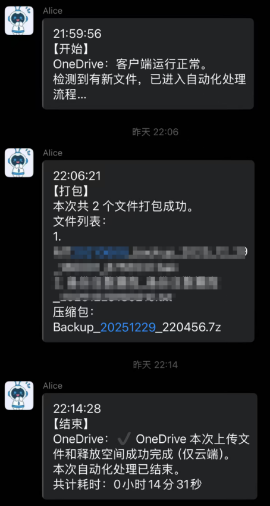

# AutoBackupZipOneDrive
一个全部代码都由GPT完成的工具，主要用于将指定目录下规定时间段内新增的文件打包成压缩包并上传至OneDrive。 
过程中的三个主要阶段：开始、打包、结束。会自动将消息发送给配置好的企业微信群。 
工具出现的任何bug请自行处理，该项目不再维护（毕竟我也不懂，都是GPT写的^_^）。 
如果有大佬增加了更多好玩的功能，也请告诉我哈^_^。 

 

